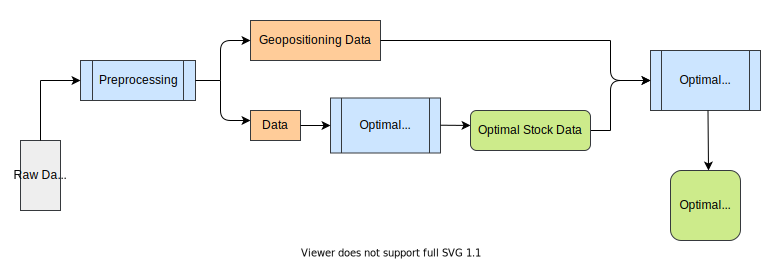

# BOA - Beverage Optimal Allocation

## Overview
This project aims to provide the optimal distribution of products for a unbalanced supply chain data set of Ambev. We developed two algorithms using Operational Research techniques to find the optimal balanced stock configuration, and to evaluate the exchange map between sites to reach the configuration that was calculated previously. Furthermore, we compared two solutions with different premisses using several metrics.

[You can find our presentation in Portuguese here.](https://drive.google.com/file/d/1wqLO27wx3kebZhj6CsAFjz4CKdggN9vb/view?usp=sharing)

### Problem
To avoid misconceptions, we explain some concepts before introducing the problem. There are three types of a site: supply site, distributor, and depot. A supply site produces beverages for distributors and depots. A distributor can send a product to a depot, and vice versa. However, a supply site cannot receive a product from distributor or depot. On these premisses, we define the first version of the problem. Moreover, the second version assumes that products of distributors cannot be sent to depots, and vice versa.

Given the data set of Ambev's supply chain, we want to distribute the available products between supply sites, distributors, and depots in order to have a balanced stock in all sites with a minimum transportation cost. The problem can be broken into two subproblems: evaluation of the optimal stock in each site, and generation of the optimal exchange map. The optimal stock should be evaluated in relation to some reference stock, such as reorder stock or maximum stock. The exchange map of a product is defined as the amount of product that leaves or goes to each site. Furthermore, the geopositioning of each site should be used to estimate the distance between two sites. We solved the two subproblems for the two versions of the problem.

### Solution
The solution can be divided into four steps: data preprocessing, evaluation of optimal stock, generation of optimal exchange map, and definition of metrics to compare each version of the problem. The following paragraphs explain each step.

We removed all rows with infinite values in the Ambev's data set, since they had a maximum stock of zero. We generated geopositioning for all sites based on longitude and latitude of Belgium cities. The sites' position were generated using a uniform distribution with a fixed seed for reproducibility purposes.

We chose the reference stock based on the scenario of a grid. The scenario gives the business rules to distribute the products. When the business rule states that the sites must be balanced in relation to a reference stock, we used Quadratic Programming to find the optimal stock in a grid. Furthermore, the business rules defines the constraints of the QP problem.

Once we had the optimal stock of each site in a grid, we calculated the best way to distribute products among supply sites, distributors, and depots using Linear Programming. The LP problem uses the distance between two sites as the product unit cost. Moreover, the constraints states that the amount of product that leaves or goes to a grid must be equal to the difference between the balanced stock and the unbalanced stock.

In the end, we generated metrics to compare the two versions of the problem, such as the percentage of sites that have a stock greater than maximum stock in a grid, and the ratio between closing stock and reorder stock in all sites.

### Solution Architecture



## Dependencies
Install the requirements in `requirements.txt` in a virtual environment, such as `venv`. [You can find venv installation guide here.](https://packaging.python.org/guides/installing-using-pip-and-virtual-environments/)

## Run

Run `make run` to execute all main source files if you have `make`. Otherwise, run the following files in order. The Ambev's data set called `raw_data.csv` must be in `data` folder. This file must use semicolons as delimiter and colons as decimal.  

````
python3 src/features/preprocessing.py      # removes useless data and generates geopositioning to sites
python3 src/all_distributions.py           # generates first step output with desired final stocks
python3 src/all_exchanges.py               # generates second step output with all exchanges needed
python3 src/visualization/plot_metric.py   # plots stock balance metrics
python3 src/visualization/plot_grid.py     # plots grid stocks after/before rebalancing and exchange map for a given grid
python3 src/visualization/plot_comparison.py # plots histograms of current stock / reorder point with and without redistribution
````

## Team

| [<br><sub>@alexandremr01</sub>](https://github.com/alexandremr01) | [<br><sub>@davimnz</sub>](https://github.com/davimnz) |
| :---: | :---: |
